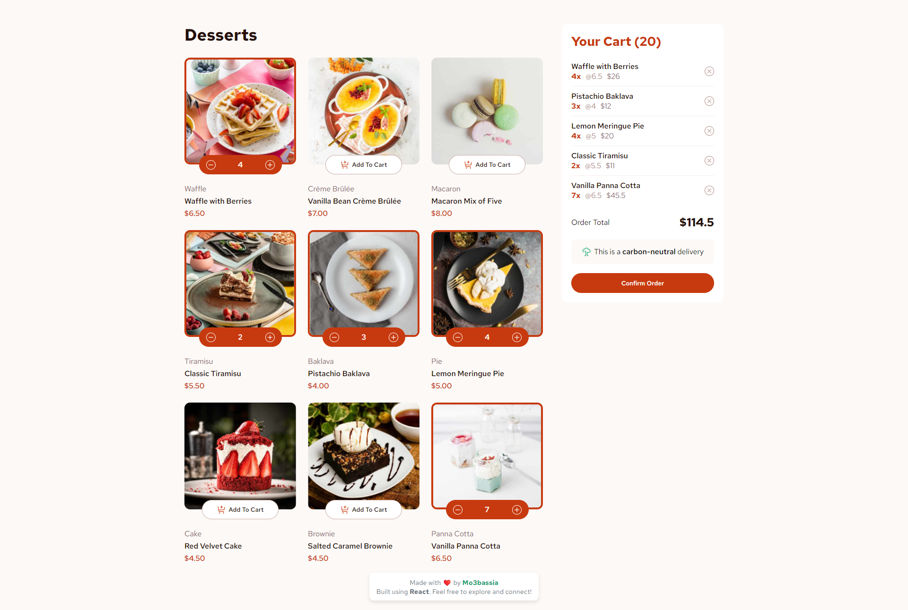

# Product List with Cart 🛒 (React Version)

## Live Demo 🔗

Check out the live version of the project: [https://product-list-with-cart-mo3bassias-projects.vercel.app](https://product-list-with-cart-mo3bassias-projects.vercel.app)

## Project Overview 📦

This project is part of a challenge from [Frontend Mentor](https://www.frontendmentor.io/challenges/product-list-with-cart-5MmqLVAp_d), where I created a product list with a shopping cart using **React**. The challenge required adding and removing products from the cart, dynamically calculating totals, and ensuring responsiveness.

## What I Learned and Applied in React 🚀

- 📦 **Component-Based Architecture**: Understood the concept of a component-based application structure and how to build reusable components.

- 🎛️ **State Management with useState Hook**: Learned how to use `useState` to manage state, which helped me control dynamic data in the user interface.

- 🔄 **Props for Data Flow**: Discovered how to pass data between components using **props** for organized and structured data flow.

- ⏳ **useEffect for Side Effects**: Learned how to use `useEffect` for managing side effects like fetching data.

- 🧠 **Conditional Rendering**: Learned how to render specific elements based on state, enhancing user experience.

- 🎯 **Handling User Events**: Gained skills in managing user interactions like button clicks.

- 🎨 **Responsive Design with CSS**: Utilized **CSS** to design the interface and ensure responsiveness across different screen sizes.

- 🔑 **Optimization Using Key Props**: Understood the importance of using `key` when rendering lists to improve performance.

## Features ✨

- Dynamic rendering of product lists.
- Functional shopping cart with the ability to add and remove items.
- Real-time price calculations for the shopping cart.
- Responsive design to ensure a good experience on all devices.
- User-friendly interface with clear buttons and notifications.

## Solution Link 🔗

You can view my solution on Frontend Mentor here: [Product List with Cart Solution](https://www.frontendmentor.io/solutions/product-list-with-cart-react-app-4qZkQ4G8ON)

---

Feel free to check out the project live and provide feedback! 😊
